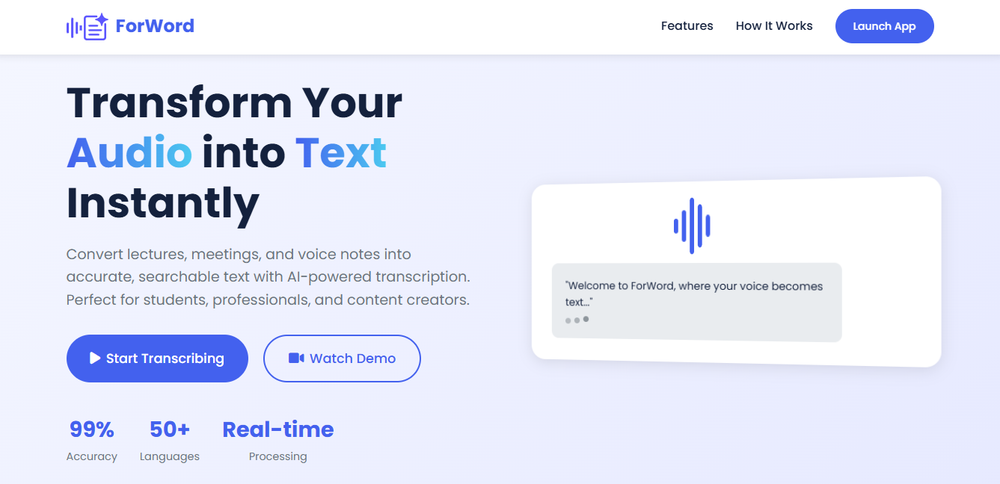
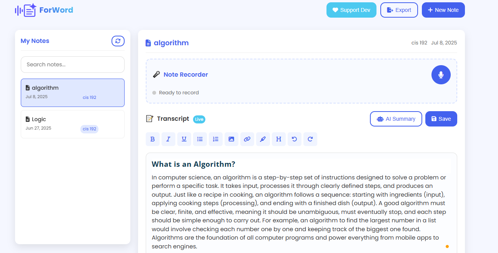
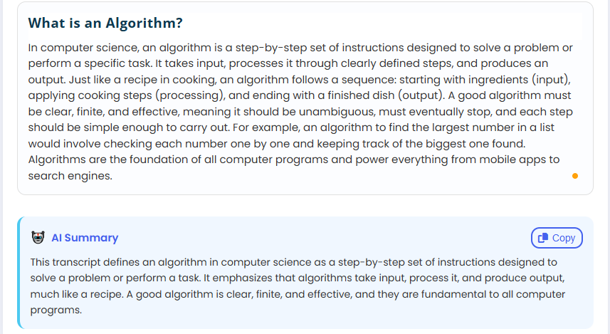

# ForWord - Audio to Text Application

## Overview

ForWord is a simple web application that converts speech to text and provides AI summaries using Google Cloud Speech-to-Text API and Google's Gemini API. It prioritizes user privacy by not storing audio recordings or transcriptions on its servers. All notes are saved locally in the user's browser.



## Features

-   **Speech-to-Text Conversion:** Converts audio to text using Google Cloud Speech-to-Text API.
-   **AI Summaries:** Generates AI summaries of transcriptions using Google's Gemini API.
-   **Local Storage:** Saves notes locally in the browser.
-   **Privacy-Focused:** Does not store audio or transcriptions on our servers.
-   **User-Friendly:** Simple and intuitive interface.

## Screenshots


*Main interface showing the recording and transcription area.*


*AI summary generated from the transcribed text.*

## Technologies Used

-   HTML
-   CSS
-   JavaScript
-   Google Cloud Speech-to-Text API
-   Google Gemini API

## Setup Instructions

1.  **Clone the repository:**

    ```bash
    git clone [repository URL]
    cd audio-to-text-app
    ```

2.  **Obtain API Keys:**

    -   You will need to set up a Google Cloud project and enable the Speech-to-Text API. Obtain the necessary API key or set up authentication.
    -   You will also need to obtain an API key for Google's Gemini API.

3.  **Configuration:**

    -   Update the JavaScript code with your Google Cloud Speech-to-Text API key and Google Gemini API key.

4.  **Open the application:**

    -   Open `forword.html` in your web browser.

## Usage

1.  **Grant Microphone Access:**

    -   The application will request access to your microphone. Grant the necessary permissions.

2.  **Start Recording:**

    -   Click the record button to start recording your speech.

3.  **Stop Recording:**

    -   Click the stop button to stop recording. The audio will be sent to Google Cloud for transcription.

4.  **View Transcription:**

    -   The transcribed text will be displayed in the application.

5.  **Generate AI Summary:**

    -   Click the "Generate Summary" button to create an AI summary of the transcription using Google's Gemini API.

6.  **Save Notes:**

    -   Save your notes locally in your browser.

## Privacy Policy

For detailed information on how your data is handled, please refer to the [Privacy Policy](privacy.html).

## Contributing

Contributions are welcome! Please feel free to submit pull requests or open issues for any bugs or feature requests.

## License

This project is open source and available under the [License Name] License.

## Contact

For any questions or feedback, please contact:

-   Blessing Emejulu (Creator of ForWord)
-   Feedback Form: [Submit Question](https://forms.gle/XuZ5ebrY4SwqDBFPA)